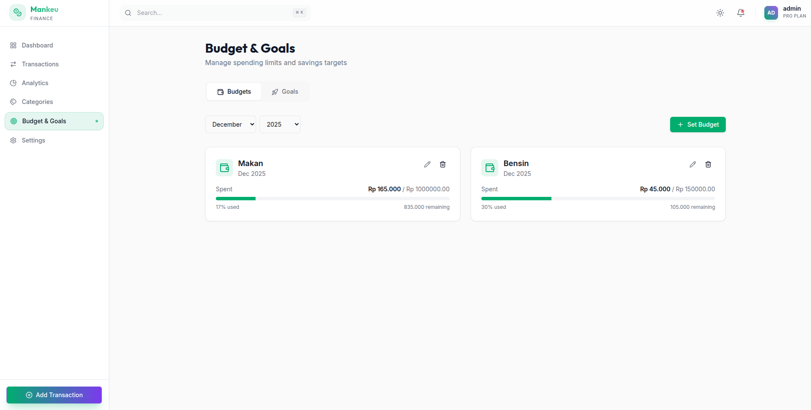
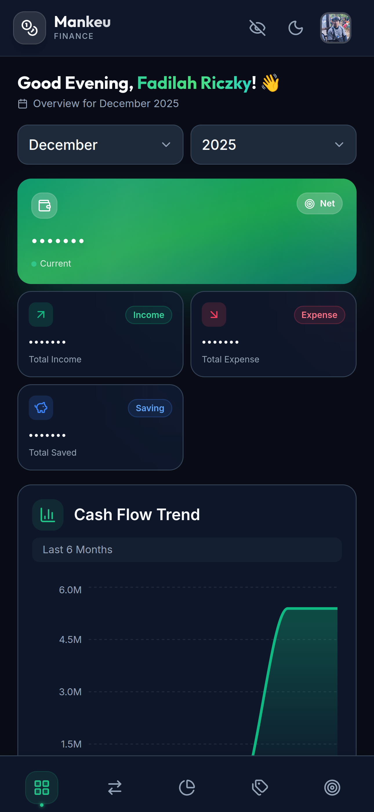
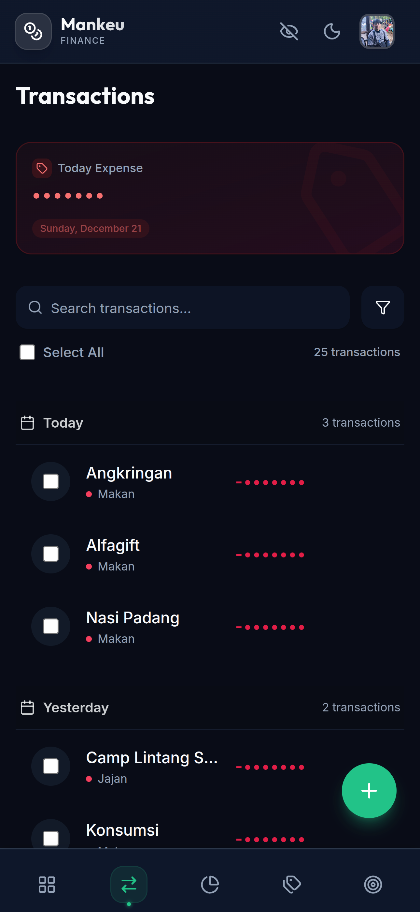
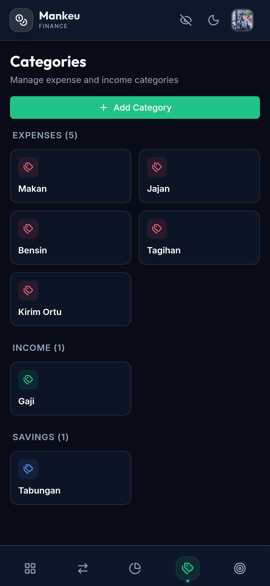
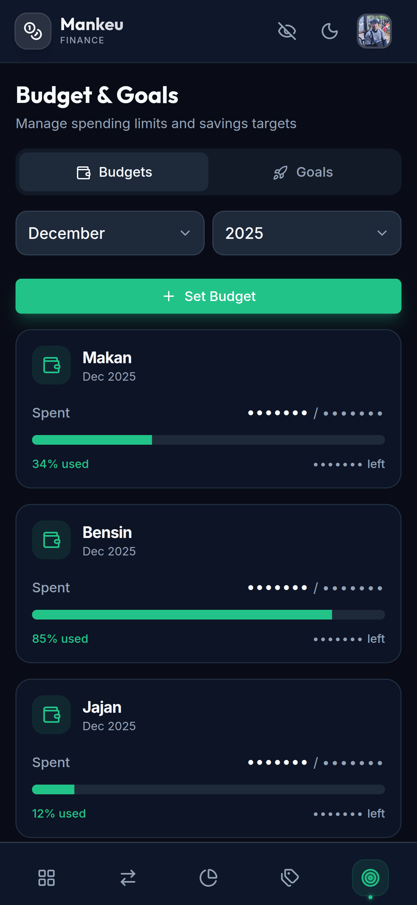
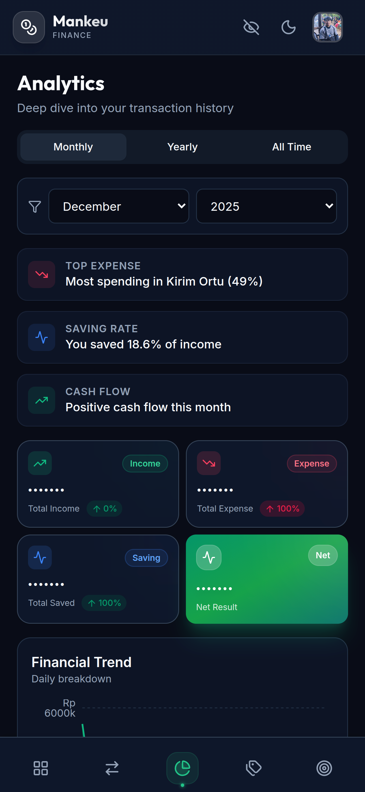

# Mankeu - Personal Finance Management

Mankeu is a modern, feature-rich personal finance management application designed to help you track your income, expenses, budgets, and financial goals with ease. Built with a focus on user experience and visual aesthetics, it offers a premium, intuitive interface for managing your personal finances.

## features

- **📊 Interactive Dashboard**: Get a real-time overview of your financial health with cash flow trends, expense breakdowns, and budget status.
- **💰 Transaction Tracking**: Easily record and categorize income and expenses.
- **📉 Analytics**: Visualise your spending habits with detailed charts and graphs.
- **🎯 Budget & Goals**: Set monthly budgets and financial goals to stay on track.
- **🏷️ Category Management**: Customize categories to fit your specific needs.
- **🌓 Dark Mode**: Fully supported dark mode for a comfortable viewing experience.

## Screenshots

### Dashboard

*Get a comprehensive overview of your financial health with interactive charts and real-time statistics*

### Transactions

*Track all your income and expenses with detailed categorization and filtering options*

### Categories

*Manage and customize your transaction categories to fit your needs*

### Budget & Goals

*Set and monitor your monthly budgets and financial goals*

## Mobile Screenshots

<div style="display: flex; flex-wrap: wrap; gap: 10px; justify-content: center;">
  
  
  
  
  
</div>


## Tech Stack

### Frontend
- **Framework**: React (Vite)
- **Styling**: TailwindCSS, Vanilla CSS (for custom animations/effects)
- **Icons**: Lucide React
- **Charts**: Recharts
- **State Management**: Zustand (Auth/Theme), TanStack Query (Data types)

### Backend
- **Framework**: FastAPI (Python)
- **Database**: MySQL
- **ORM**: SQLAlchemy
- **Data Validation**: Pydantic

## Getting Started

### 🚀 Quick Try
For those who prefer to use a hosted server instead of setting up their own backend, you can use the following URL:
**https://api-finance.noma.my.id**

### Prerequisites
- [Bun](https://bun.sh) (v1.0+)
- [uv](https://github.com/astral-sh/uv) (v0.1+)
- MySQL Server

### Installation

1. **Clone the repository**
   ```bash
   git clone https://github.com/yourusername/mankeu.git
   cd mankeu
   ```

2. **Backend Setup**
   ```bash
   cd backend
   
   # Create virtual environment and install dependencies using uv
   uv venv
   source .venv/bin/activate  # On Windows: .venv\Scripts\activate
   uv pip install -r requirements.txt
   
   # Setup environment variables
   cp .env.example .env
   # Update .env with your database credentials
   
   # Start server
   uv run uvicorn app.main:app --reload
   ```

3. **Frontend Setup**
   ```bash
   cd frontend
   bun install
   bun dev
   ```

4. **Access the application**
   - Frontend: `http://localhost:5173`
   -  Backend API Docs: `http://localhost:8000/docs`

## License

This project is licensed under the MIT License.
